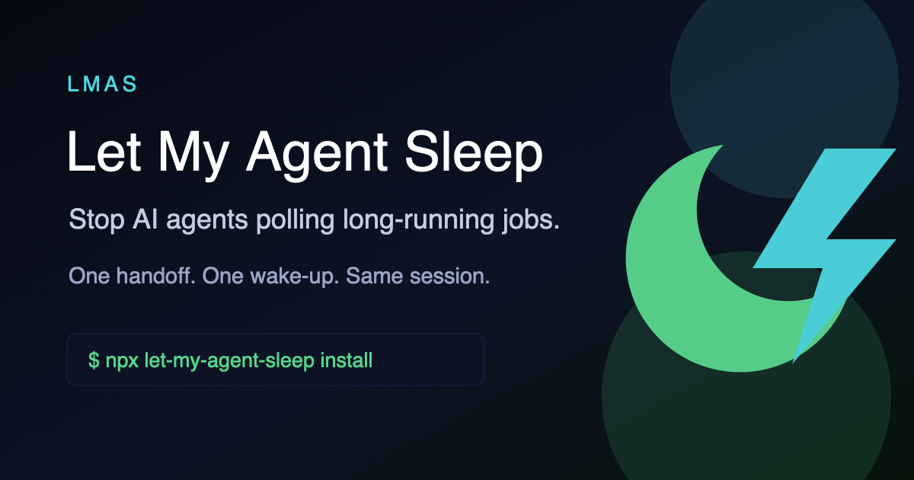

<div align="center">
  

  <h1>Let My Agent Sleep</h1>

  <p><strong>Start long jobs. Stop the loop. Resume supported agent sessions when they finish.</strong></p>

  <p>
    <a href="https://www.npmjs.com/package/let-my-agent-sleep"></a>
    <a href="https://www.npmjs.com/package/let-my-agent-sleep"></a>
    <a href="https://github.com/jaein4722/Let-My-Agent-Sleep"></a>
    <a href="LICENSE"></a>
  </p>

  <p>
    <a href="https://jaein4722.github.io/Let-My-Agent-Sleep/"><strong>Website</strong></a>
    ·
    <a href="https://jaein4722.github.io/Let-My-Agent-Sleep/docs/"><strong>Docs</strong></a>
    ·
    <a href="https://www.npmjs.com/package/let-my-agent-sleep"><strong>npm</strong></a>
  </p>
</div>

---

AI agents should not spend hours polling a training log.

Let My Agent Sleep, or LMAS, lets OpenCode, Codex, and Claude Code start long-running training, evaluation, preprocessing, benchmark, migration, or batch jobs, hand them off, stop waiting, and resume a supported agent session when the job finishes. When exact resume is not available, LMAS records a manual resume prompt.

```text
start job -> LMAS_HANDOFF v1 -> agent stops
job exits -> LMAS_COMPLETION_EVENT v1 -> session resumes or prompt is recorded
```

## Contents

- [Why](#why)
- [Quick Start](#quick-start)
- [Agent Support](#agent-support)
- [OpenCode](#opencode)
- [Codex](#codex)
- [Claude Code](#claude-code)
- [CLI](#cli)
- [Runtime Artifacts](#runtime-artifacts)
- [Why Not nohup?](#why-not-nohup)
- [Cost Model](#cost-model)
- [FAQ](#faq)

## Why

Without LMAS, a long-running job often turns into an expensive agent loop:

| Without LMAS | With LMAS |
| --- | --- |
| Agent starts a job and keeps checking logs. | Agent starts a job and receives a handoff. |
| Context fills with repeated `tail`, `ps`, and status output. | The session goes quiet while the job runs. |
| Loop runners keep forcing `continue`. | Completion wakes a supported session once. |
| Cost grows with wall-clock wait time. | Cost is handoff plus completion handling. |

LMAS does not make useful agent work free. It removes the waiting portion: polling turns, repeated context reloads, and artificial continue loops.

## Quick Start

Requirements:

- `tmux` installed and available on `PATH`
- Node.js with `npx` or a global npm install

Install:

```bash
npx let-my-agent-sleep install
```

Or install globally and use the short alias:

```bash
npm install -g let-my-agent-sleep
lmas install
```

Restart your agent after installation.

Then ask the agent to use LMAS for long-running work:

```text
Use the let-my-agent-sleep skill for this task.
Start the training job with:
python train.py --config configs/exp.yaml
After LMAS_HANDOFF v1, stop and do not wait or poll.
```

The agent should start the job, report a `run_id`, and stop. When the job finishes, LMAS injects an `LMAS_COMPLETION_EVENT v1` message so the agent can inspect logs, summarize results, and continue.

## Agent Support

| Agent | Status | Resume path |
| --- | --- | --- |
| OpenCode | Primary | Plugin tools and native completion prompt injection |
| Codex | Supported | Same-session resume from the job environment |
| Claude Code | Experimental | Native background waiter while the session lives; durable resume fallback otherwise |

Install for a specific agent:

```bash
npx let-my-agent-sleep install --agent opencode
npx let-my-agent-sleep install --agent codex
npx let-my-agent-sleep install --agent claude  # experimental
npx let-my-agent-sleep install --agent detected --yes
npx let-my-agent-sleep install --agent all --yes
```

Use `--dry-run` to preview changes before writing files.

## OpenCode

OpenCode is the primary target. The installer adds the Let My Agent Sleep plugin and skill, including:

- `lmas_start`
- `lmas_status`
- `lmas_cancel`
- `lmas_info`

If OpenCode is running on a non-default server URL, pass that URL when asking the agent to start a job.
The OpenCode server that owns the session must still be running when the watched job finishes; otherwise LMAS keeps `resume_prompt.txt` for manual recovery.

For OpenCode installs, LMAS does not modify Oh My OpenAgent `disabled_hooks` or `disabled_skills`:

```bash
npx let-my-agent-sleep install --agent opencode
```

Existing OMO settings are preserved. `lmas doctor --agent opencode` warns when known continuation hooks may be residue from an LMAS 0.3.0 install, but never removes them automatically. The OpenCode plugin blocks explicitly marked or clearly identified continuation prompts only while an `LMAS_HANDOFF v1` is active in the same session.

LMAS also installs a runtime guard in the OpenCode plugin. While an `LMAS_HANDOFF v1` is active, OMO initiator markers, compaction-continuation metadata, and known TODO/Ralph/Boulder or explicit continue-work prompts are no-oped until `LMAS_COMPLETION_EVENT v1` arrives. Unmarked fallback prompts, benign synthetic notifications, direct user slash commands, `noReply` internal notifications, and LMAS completion prompts pass through. A direct user request authorizes one exact-run status or cancel action without ending the handoff. `lmas_info` reports current guard and run state for live doctor checks, and the OpenCode TUI sidebar shows whether the current session has an active LMAS guard plus the visible active/finalizing runs.

OpenCode docs: https://jaein4722.github.io/Let-My-Agent-Sleep/docs/opencode.html

## Codex

Codex support is available through the installed Let My Agent Sleep skill.

For automatic resume, the Codex session must be resumable from the environment where the job is running.
For a server or SSH workflow with live TUI wake-up, run Codex's built-in app server and attach the TUI to it; LMAS installs no service, wrapper, or alternate Codex binary:

```bash
codex app-server --listen unix://
# From the terminal where you use Codex:
codex --remote unix://
```

Keep the app-server command alive with the same tmux/systemd setup you already use for remote services. LMAS detects its same-user default Unix socket and starts the completion turn through that active owner, so the attached TUI updates immediately. The Desktop owner is retained as a secondary live route. If neither live owner is available, LMAS falls back to `codex exec resume`; that separate-process path requires reloading or reopening a TUI or Desktop view that stayed open. LMAS never installs, bootstraps, or starts a Codex service and never changes the Codex executable path. Set `LMAS_CODEX_LIVE_WAKE=0` to disable live attempts, and use `LMAS_CODEX_BIN=/path/to/codex` only to override the fallback executable.

Codex docs: https://jaein4722.github.io/Let-My-Agent-Sleep/docs/codex.html

## Claude Code

Claude Code support is experimental. After LMAS starts and verifies the tmux-owned job, the installed `/let-my-agent-sleep` command registers `lmas await <run_id>` as Claude's own native background task. If that Claude session and waiter stay alive, completion ends the waiter, wakes the same session, and lets it continue without polling. The waiter never owns the real job.

If Claude exits, the real command keeps running under LMAS and tmux. A background Bash child can briefly survive as an orphan, so LMAS records both the waiter and its owning Claude process; native delivery is eligible only while both exact processes remain alive. When completion proves that no native path can deliver it, LMAS uses the existing `claude --resume` path. An atomic delivery claim prevents native and fallback completion payloads from both winning. Ambiguous post-claim failures suppress fallback to avoid duplicates and retain `resume_prompt.txt` for recovery. LMAS installs no daemon, executable wrapper, or PATH change. Set `LMAS_CLAUDE_CONTINUE=1` only when continuing the most recent Claude session in the current working directory is acceptable.

Claude Code docs: https://jaein4722.github.io/Let-My-Agent-Sleep/docs/claude-code.html

## CLI

```bash
lmas start -- python train.py --config configs/exp.yaml
lmas await <run_id> # Claude native background task only
lmas status <run_id>
lmas list
lmas cancel <run_id>
lmas start --notify https://ntfy.sh/my-topic -- python train.py
lmas doctor --agent opencode
lmas doctor --agent opencode --server-url http://127.0.0.1:4096
lmas doctor --agent opencode --server-url http://127.0.0.1:4096 --directory "$PWD"
lmas doctor --agent opencode --server-url http://127.0.0.1:4096 --workspace "<workspace-id>"
LMAS_OPENCODE_PASSWORD=<password> lmas doctor --agent opencode --server-url http://127.0.0.1:4096
```

Most users should let the agent call the installed skill or plugin tool instead of calling the CLI directly. The CLI is still useful for debugging, manual runs, and fallback workflows.

Direct `lmas start` uses the `noop` adapter unless `--adapter` or `LMAS_ADAPTER` is set. It always writes `resume_prompt.txt`; automatic session resume requires the matching agent adapter.

`--notify <url>` posts the completion resume prompt to a secondary webhook or ntfy URL after the job exits. Only `http://` and `https://` URLs are accepted. It does not replace session resume; it is only an extra notification path. If the URL contains a secret, prefer environment injection and do not put it in prompts or shared logs. Run artifacts can contain commands, local paths, and metadata; LMAS creates them with owner-only permissions, but they should still be treated as sensitive.

HTTP completion paths are bounded: OpenCode adapter calls and `--notify` use `LMAS_HTTP_CONNECT_TIMEOUT` (default `5` seconds) and `LMAS_HTTP_MAX_TIME` (default `30` seconds). A timeout leaves `resume_prompt.txt` available for manual recovery.

## Runtime Artifacts

Runs are stored under:

```text
.lmas/runs/<run_id>/
```

Common files:

- `handoff.txt`
- `completion_event.txt`
- `stdout.log`
- `stderr.log`
- `metadata.txt`
- `resume_prompt.txt`
- `notify.log` (only when `--notify` or `LMAS_NOTIFY_URL` is set)
- `progress.txt` (optional, written by your job)

Keep `.lmas/` ignored by git. Do not place secrets in command-line arguments or metadata. LMAS targets Bash, tmux, curl, and standard Unix process tools on macOS and Linux.

`lmas list` includes `elapsed_seconds` and a short command summary. `lmas status <run_id>` includes the command, elapsed time, and the last line of `progress.txt` when that file exists. `FINALIZING` means the process has exited and LMAS is preparing `resume_prompt.txt` plus `completion_event.txt`; it is still a stop-and-wait state, not permission to poll. Status checks are for explicit user requests only; agents must still stop after `LMAS_HANDOFF v1` and must not poll.

## Why Not nohup?

`nohup` keeps a process alive. LMAS also gives the agent a clean handoff point, records run metadata, watches for process exit, and injects a completion event so a supported session can continue.

More detail: https://jaein4722.github.io/Let-My-Agent-Sleep/docs/why-not-nohup.html

## Cost Model

In one observed OpenCode loop, repeated status checks cost about `$2.72` over `10.2 minutes`. Projected over a 24-hour wait, that is about `$382` and `1.93B` tokens.

LMAS does not make completion free. The start handoff and wake-up prompt still cost tokens. The saving is that the waiting interval no longer produces polling turns.

Cost method: https://jaein4722.github.io/Let-My-Agent-Sleep/docs/cost.html

## FAQ

### Does LMAS require changing my training code?

No. LMAS wraps the command the agent was already going to run.

### Does it require a daemon?

LMAS itself does not run a daemon. It uses `tmux` and plain files, with no database, cloud scheduler, or project-specific callback. OpenCode completion injection still requires the OpenCode server/session that owns the run to be alive when the job finishes. Claude's same-session native wake requires both its registered waiter and the owning Claude process to remain alive; otherwise LMAS uses the separate-process resume fallback when delivery is definitely safe. Every adapter retains `resume_prompt.txt` for recovery.

### What happens if a job fails?

The completion event includes `status`, `exit_code`, `stdout`, `stderr`, `metadata`, and `artifacts_dir`. The agent can inspect the failure and decide the next step.

### What happens if I cancel a run?

Use `lmas_cancel` from the agent or `lmas cancel <run_id>` from the CLI. If the watcher is still alive, LMAS records a `CANCELLED` completion event. If the job has already exited and LMAS is finalizing completion, cancel reports `ALREADY_COMPLETED`. If a job is killed outside LMAS and the watcher is gone, `lmas_status` reports `LOST`.

When the run was started with `--notify` or `LMAS_NOTIFY_URL`, cancellation also posts the `CANCELLED` resume prompt to that secondary notification URL.

## Links

- Website: https://jaein4722.github.io/Let-My-Agent-Sleep/
- Docs: https://jaein4722.github.io/Let-My-Agent-Sleep/docs/
- GitHub: https://github.com/jaein4722/Let-My-Agent-Sleep
- npm: https://www.npmjs.com/package/let-my-agent-sleep

## License

MIT. See [LICENSE](LICENSE).
